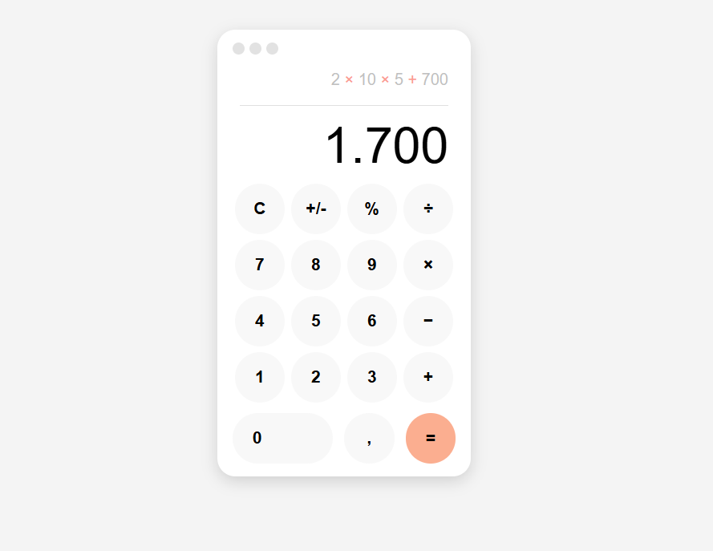
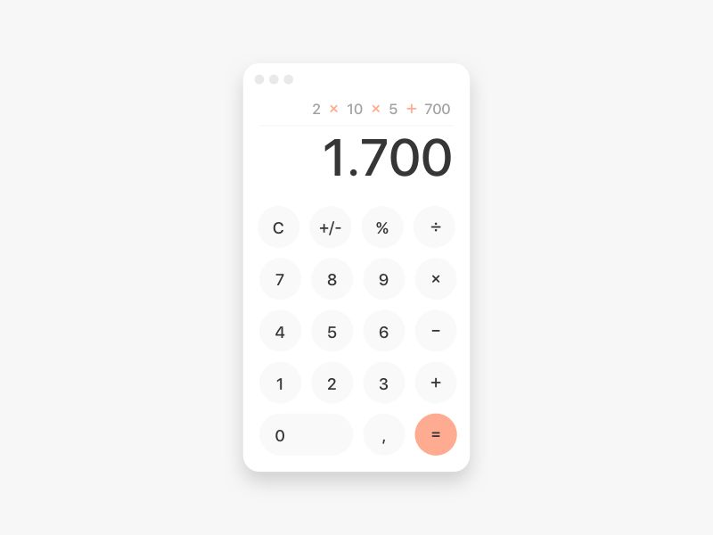

### Mini-task HTML Kalkulator
Program ini dibuat dengan HTML5 dan CCS3 dan dibuat agar dapat meniru dari tampilan desain referensinya.

#### Berikut merupakan preview dari hasil mini task:

#### Referensi UI Kalkulator:

#### Sumber gambar :
https://id.pinterest.com/pin/560135272396901791/

## Program revamp
Program ini dikembangkan lebih jauh lagi sehingga membuatnya berfungsi layaknya seperti kalkulator.

### Tech Stacks:
- jQuery

#### Preview Gif:

